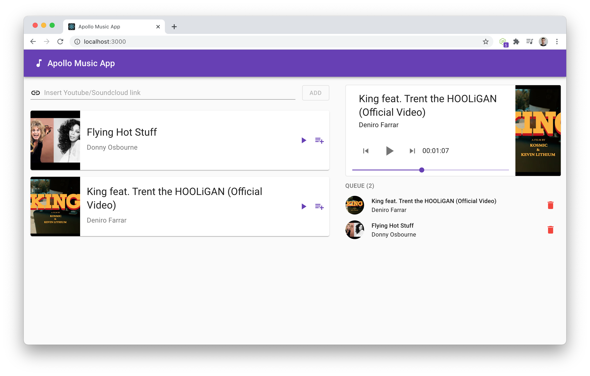

# Apollo Music App

A basic react app made with Apollo, React and Hasura/Heroku (GraphQL & Postgres)

In the app 3 types of state are used: Local (e.g. useState for buttons), Context (e.g. passing currently playing song) and Apollo State (e.g. playlist management).

There is no authentication, nor roles/users in this demo app. Some components/functionality could use more refactoring for maintainability purpose (good enough for a demo right now).

